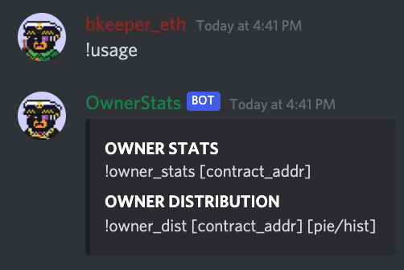
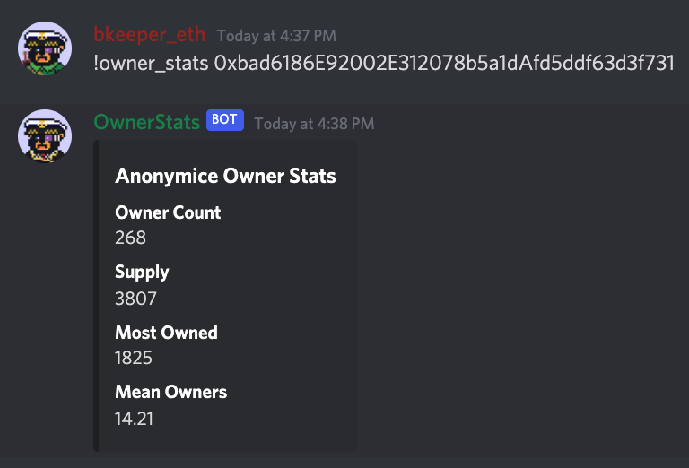
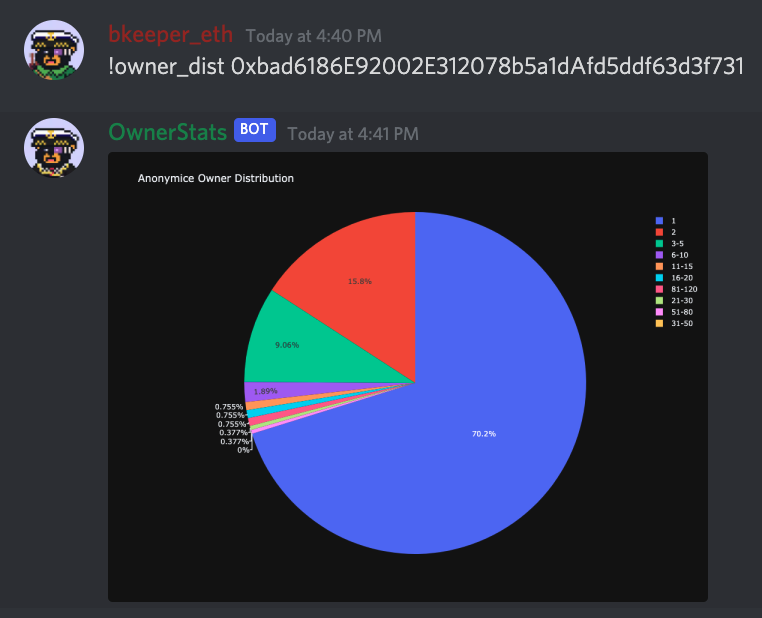
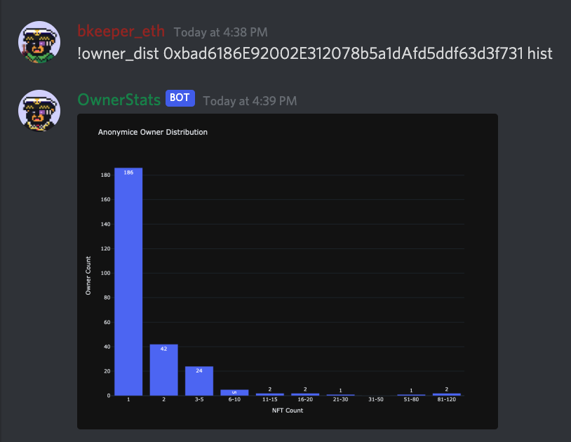

# owner_stats_bot

Prototype sample from bkeeper's purple scouter, a DIY NFT tool-suite made for discord. 
Inspired by @jumpanft's and @NFTzyBoi's works.

## Notes

CLI-style tool will output various metrics, charts, and graphs based on user-command. 

## Configuration

The bot relies on the Etherscan API. 
An ES API KEY can be obtained by signing up for an Developer Account (FREE). 

DS_TOKEN refers to the Discord Bot Token used for auth. 

## Usage - Backend
./owner_stats_bot.py -c ../etc/config.xml

## EX

  

  

  

  

